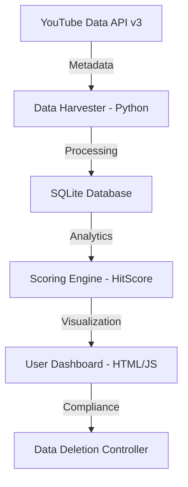

# System Design & API Integration Document: TrendFinder (D-SYSTEM)

This document provides a technical overview of how **TrendFinder (D-SYSTEM)** integrates with the YouTube Data API v3 to provide content intelligence for creators.

---

## 🏗 System Architecture
TrendFinder is a multi-layered analytics platform consisting of a Python-based data harvester, an SQLite analytical engine, and a high-performance web dashboard.

---

## 🛠 YouTube API Implementation Details

### 1. Trend Discovery (`search.list`)
*   **Purpose**: To identify rising videos within specific niche keywords (e.g., 'productivity', 'coding tips').
*   **Implementation**: We use the `search.list` endpoint with `type=video`, `order=date`, and `relevanceLanguage=ko`. 
*   **Optimization**: We perform batch searches to minimize quota consumption.

### 2. Deep Metric Analysis (`videos.list`)
*   **Purpose**: To retrieve granular engagement data (view count, like count, duration) for scoring.
*   **Implementation**: For each discovered video ID, we call `videos.list` with `part=snippet,statistics,contentDetails`.
*   **Filtering**: Videos under 60 seconds (Shorts) are strictly excluded at this stage using `contentDetails.duration`.

---

## 📊 Data Lifecycle & Compliance

### Data Retention Policy
To ensure data integrity and respect YouTube's ecosystem, we implement a strict **7-day rolling deletion policy**.
*   **Collection**: Data is fetched on-demand based on user keyword updates.
*   **Storage**: Cached in a local SQLite instance for performance.
*   **Deletion**: Any API-derived data older than 7 days is automatically purged from the system.

### User Privacy
*   TrendFinder does not collect or store any "Google User Data."
*   All accessed data is strictly "Public YouTube Content" as defined by the YouTube ToS.

---

## 🎥 Screencast Guide (for Reviewers)
*Reviewers can view the live implementation at our audit site:*
**URL**: [https://nuri218.github.io/d-system-audit/demo.html](https://nuri218.github.io/d-system-audit/demo.html)

**Screencast Script Outline**:
1.  **Dashboard Entry**: Show the "Intelligence Dashboard" displaying a grid of high-performance videos.
2.  **API Integration**: Demonstrate how each card displays YouTube-native metrics (Views, Channel Name) alongside our proprietary `HitScore`.
3.  **Compliance Check**: Scroll to the footer to show the mandatory links to **YouTube Terms of Service** and **Privacy Policy**.
4.  **Data Freshness**: Highlight the "Published At" date to show we are tracking recent trends.

---
**TrendFinder Development Team**  
*Lead Developer: nuri218*
